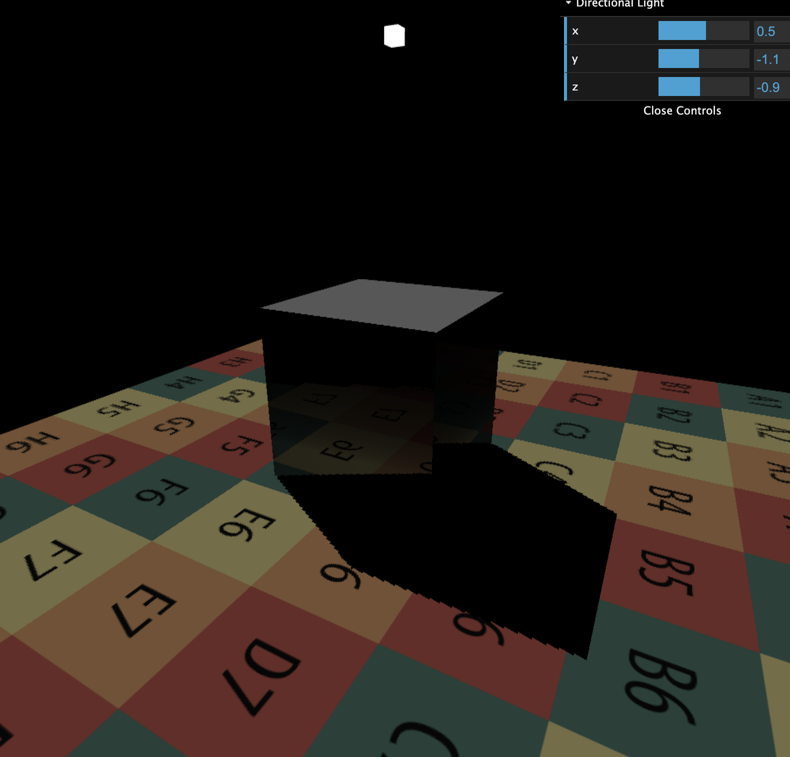
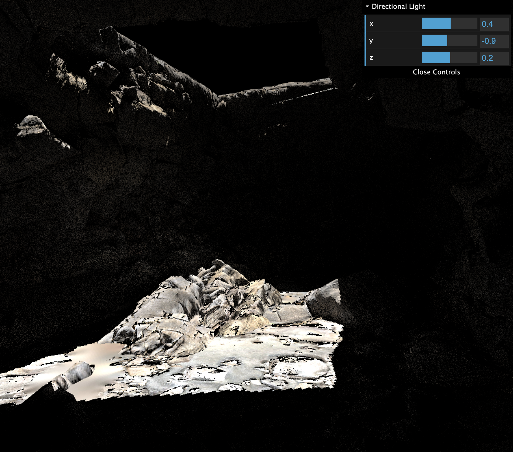

# Games 202 HW3

## Direct Lighting using Diffuse BSDF

Diffuse BSDF evaluation:
```glsl
vec3 EvalDiffuse(vec3 wi, vec3 wo, vec2 uv) {
    vec3 L = GetGBufferDiffuse(uv);
    vec3 N = normalize(GetGBufferNormalWorld(uv));
    float I = max(dot(wi, N), 0.0);
    // Cut light transport from back face
    float O = max(sign(dot(wo, N)), 0.0);
    return L * I * O / M_PI;
}
```
Irradiance evaluation:
```glsl
vec3 EvalDirectionalLight(vec2 uv) {
    vec3 Le = uLightRadiance;
    // Visibility
    float V = GetGBufferuShadow(uv);
    return Le * V;
}
```

## Indirect Lighting Using Screen Space Ray Tracing

Render indirect lighting sampling from only specular reflection



Render Cave scene with 8 Samples for indirect light per pixel



## Ray Marching Acceleration with Mipmap

To be done ...